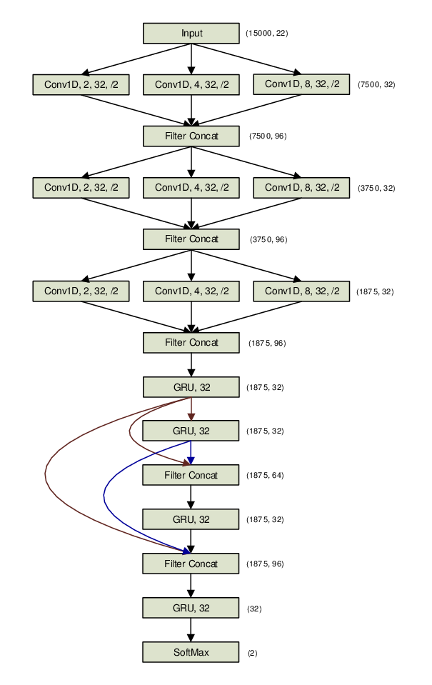
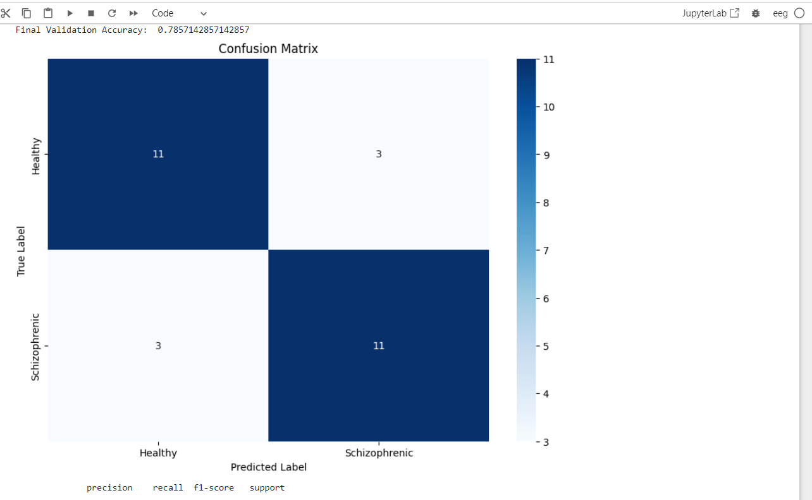

# Schizophrenia Classification

## Overview

This project is aimed at classifying Schizophrenia patients from healthy control patients using Electroencephalography (EEG) data. For this project, different classic and deep ML models were proposed. 

## Data

The dataset comprised 14 patients with paranoid schizophrenia and 14 healthy controls. Data were acquired with the sampling frequency of 250 Hz using the standard 10-20 EEG montage with 19 EEG channels: Fp1, Fp2, F7, F3, Fz, F4, F8, T3, C3, Cz, C4, T4, T5, P3, Pz, P4, T6, O1, O2. The reference electrode was placed between electrodes Fz and Cz.

## Framework

### 1. Data Reading and Processing

- **Reading EEG Data**: EEG data files in EDF format are loaded into the memory using mne.io.read_raw_edf. The data is preloaded to speed up further processing
- **Reference Setting**: The EEG data is referenced to standardize measurements across different recordings.
- **Filtering**: A bandpass filter is applied to keep frequencies between 0.5 Hz and 45 Hz, which is the typical range relevant for EEG analysis.
- **Epoching**: The continuous EEG signal is segmented into fixed-length epochs of 5 seconds with an overlap of 1 second. This duration can be adjusted to consider 10 or 30 seconds based on experimental needs.
- **Epoch Data Extraction**: Data from these epochs is extracted into numpy arrays for further analysis

### 2. Classic ML Classifiers

At first we implemented a few Classic ML Classifiers with a higher accuracy power than a baseline (in this scenario, a random model with 50% accuracy).

 - **Data Concatenation**: The code first vertically stacks the EEG data points (data_array) and horizontally combines the corresponding labels (labels_array) and group identifiers (groups_array). This organization facilitates the management of features, labels, and group data necessary for group-wise cross-validation to prevent data leakage.

**Feature Extraction**: The script computes a series of statistical features for each EEG signal, such as mean, standard deviation, peak-to-peak distance, variance, minimum, maximum, and others, including skewness and kurtosis. These features capture the variability, distribution, and dispersion characteristics of the EEG signals, making them suitable for input into machine learning models.

Since we focus on time-domain features, it is important to note that due to the nature of SVMs, the model was omitted as SVMs tend to work better with frequency-domain features.

**Machine Learning Pipeline**:

- **Logistic Regression**: The first machine learning pipeline uses a logistic regression model within a grid search cross-validation framework (GridSearchCV). The model is trained on scaled features with a hyperparameter tuning step that iterates over different regularization strengths (C). The use of GroupKFold ensures that data from the same group (here, likely corresponding to individual subjects) are not split across the train and test sets, thus maintaining the integrity of the validation process.

- **Random Forest**: Similarly, a random forest classifier is deployed with a pipeline that scales features and tunes the hyperparameters concerning the number of trees in the forest. This model is also validated using group k-fold to ensure that training and testing sets do not have overlapping data from the same subjects.

**Model Training and Validation**: Both pipelines are fitted with the EEG features, labels, and group information, and the best model configurations are determined based on their cross-validated performance. This approach helps in selecting the model that generalizes best to new, unseen data, contingent upon the structure and characteristics of EEG data.

Both Models performed better than a random model, with approximately 66% accuracy with no rigorous hyperparameter tuning.

### 3. Deep ML Classifiers

As for Deep Learning solutions we were concerned with a few options.

Since the data is time-series (Sequential), it is important to incorporate a Deep model that temporal elements into its modelling, examples include: 1DCNN, LSTM,GRU and their variants.

It is also important to note that there are 18 channels per signal, which points to the direction of using convolution to discover features.

1DCNN are proposed, as well as a sequential model including both Convolutional layers and GRU layers. I also propose the usage of Chrononet, a Deep CNN-GRU architecture that works well with EEG signals. ChronoNet is formed by stacking multiple 1D convolution layers followed by deep gated recurrent unit (GRU) layers where each 1D convolution layer uses multiple filters of exponentially varying lengths and the stacked GRU layers are densely connected in a feed-forward manner. It has been shown to succeed at getting great results for EEG classification. 

There is its architecture:

Both GroupKFold and LOGO were used (for avoiding data leakage) for validating with different hyperparameters and different duration of he signal (5 seconds, 10 seconds, 30 seconds). Model that was most suitable was selected and saved.

In our evaluation, instead of taking into account every prediction of every signal of one patient, a different evaluation was implemented where for each patient, all of their predictions are taken into a majority vote to classify whether this PATIENT (AND NOT THIS EPOCH SIGNAL) is schizophrenic or not.

